**标准 TimesNet 架构图**（时序预测SOTA模型，严格贴合论文核心：**1D时序→2D周期变换、时序分解、多尺度时间卷积、TimesBlock堆叠**），风格和你之前全套深度学习架构完全统一，可直接用于笔记/PPT。

# TimesNet 完整架构流程图

```mermaid
flowchart LR
    %% 统一样式（和Transformer/YOLO/SimCLR风格一致）
    classDef inputStyle fill:#f9f,stroke:#333,stroke-width:2px,rounded:8px
    classDef embedStyle fill:#ffd700,stroke:#333,stroke-width:2px,rounded:8px
    classDef blockStyle fill:#9ff,stroke:#333,stroke-width:2px,rounded:8px
    classDef convStyle fill:#9f9,stroke:#333,stroke-width:2px,rounded:8px
    classDef decompStyle fill:#ff9,stroke:#333,stroke-width:2px,rounded:8px
    classDef headStyle fill:#f2e6ff,stroke:#333,stroke-width:2px,rounded:8px
    classDef subgraphStyle fill:#f5f5f5,stroke:#666,stroke-width:1px,rounded:10px
    classDef coreNoteStyle fill:#fff8e6,stroke:#ffb74d,stroke-width:1px,rounded:8px

    %% 1. 输入层
    subgraph InputLayer["输入层"]
        A[一维时间序列<br/>Input Time Series]:::inputStyle
    end
    class InputLayer subgraphStyle

    %% 2. 嵌入层
    subgraph EmbedLayer["时序嵌入层"]
        B[Value Embedding<br/>数值嵌入]:::embedStyle
        C[Positional Embedding<br/>位置嵌入]:::embedStyle
        D[Embedding Sum<br/>特征融合]:::embedStyle
    end
    class EmbedLayer subgraphStyle

    %% 3. 核心：TimesBlock 堆叠（N层）
    subgraph TimesBlockStack["TimesBlock 堆叠 × N（核心）"]
        %% 单个TimesBlock
        subgraph TimesBlock["单层 TimesBlock"]
            %% 时序分解（趋势+季节+残差）
            E[STD 时序分解<br/>Seasonal-Trend-Residual]:::decompStyle

            %% TimesNet核心创新：1D→2D周期变换
            F[1D→2D 周期变换<br/>按周期展开为二维矩阵]:::blockStyle

            %% 多尺度时间卷积（Inception结构）
            subgraph MultiScaleConv["多尺度时间卷积"]
                G[Conv1×1<br/>短周期]:::convStyle
                H[Conv3×3<br/>中周期]:::convStyle
                I[Conv5×5<br/>长周期]:::convStyle
            end
            class MultiScaleConv subgraphStyle

            J[Concat 特征拼接]:::convStyle
            K[Linear 投影<br/>周期特征融合]:::convStyle

            %% 残差连接+层归一化
            L[Add & Layer Norm]:::blockStyle
        end
        class TimesBlock subgraphStyle
    end
    class TimesBlockStack subgraphStyle

    %% 4. 预测输出层
    subgraph OutputLayer["预测头"]
        M[Flatten 展平<br/>2D→1D]:::headStyle
        N[Linear 预测层<br/>输出预测序列]:::headStyle
        O[预测结果<br/>Forecasting Output]:::inputStyle
    end
    class OutputLayer subgraphStyle

    %% 核心注释（TimesNet创新点）
    Note["TimesNet 核心创新：\n1. 1D时序转2D周期矩阵，用卷积捕获周期依赖\n2. 时序分解(STD)分离趋势/季节/噪声\n3. 多尺度卷积适配长短周期\n4. 专为长时序预测设计"]:::coreNoteStyle

    %% 数据流
    A --> B --> D
    A --> C --> D

    D --> E --> F --> G & H & I --> J --> K --> L
    L --> E 
    L --> M --> N --> O

    %% 连接线样式
    linkStyle 0,1,2 stroke:#ff7043,stroke-width:1.5px
    linkStyle 3,4,5 stroke:#4299e1,stroke-width:2px
    linkStyle 6,7,8 stroke:#9c27b0,stroke-width:2px
    linkStyle 9,10 stroke:#e53935,stroke-width:2px
```

---

# TimesNet 极简核心总结

1. **定位**：**长时序预测** SOTA 模型，解决时序周期依赖建模难题
2. **核心Backbone**：**TimesBlock** 堆叠
3. **最大创新**
    - 把**一维时序 → 二维周期矩阵**，用卷积高效提取周期特征
    - 时序分解（STD）分离**趋势项 + 季节项 + 残差项**
    - 多尺度卷积适配**短/中/长**不同周期
4. **结构范式**
输入 → 嵌入 → TimesBlock（分解+2D变换+多尺度卷积）→ 预测头