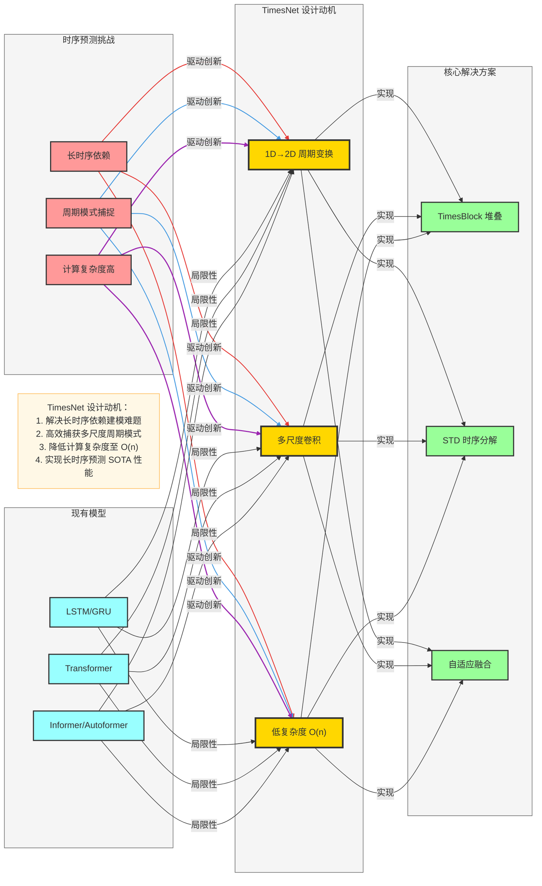

# TimesNet 理论基础与动机

## 一、时序预测的核心挑战

### 1. 长时序依赖建模
- **挑战**：传统模型（如 LSTM、GRU）难以捕获长距离依赖关系，随着序列长度增加，梯度消失问题加剧
- **影响**：长期趋势预测精度下降，模型难以学习跨多个时间步的模式

### 2. 周期模式捕捉
- **挑战**：时序数据常包含多个时间尺度的周期模式（如日、周、月、年），传统模型难以同时建模不同尺度的周期
- **影响**：对周期性强的序列（如电力负荷、交通流量）预测效果差

### 3. 计算复杂度
- **挑战**：Transformer 类模型的自注意力机制时间复杂度为 O(n²)，在长时序场景下计算成本极高
- **影响**：无法处理超长序列（如 1000+ 时间步），限制了模型在实际应用中的使用

## 二、现有模型的局限性

| 模型 | 优势 | 局限性 |
|------|------|--------|
| LSTM/GRU | 适合短时序，实现简单 | 长时序梯度消失，周期建模能力弱 |
| Transformer | 并行计算，长依赖建模 | O(n²) 复杂度，计算成本高 |
| Informer | 稀疏注意力，降低复杂度 | 仍依赖注意力机制，周期建模能力有限 |
| Autoformer | 自相关机制，适配周期 | 周期建模仍基于时间域，表达能力有限 |

## 三、TimesNet 的设计动机

### 1. 核心思想：1D→2D 周期变换
- **灵感**：将一维时间序列按周期展开为二维矩阵，利用卷积神经网络（CNN）高效捕获空间-时间依赖
- **优势**：CNN 的并行计算能力和局部连接特性，适合处理周期模式

### 2. 解决的关键问题
- **周期建模**：通过 2D 变换，将不同周期尺度的信息映射到矩阵的不同维度
- **计算复杂度**：CNN 的时间复杂度为 O(n)，远低于自注意力的 O(n²)
- **长时序适应**：多尺度卷积设计，适配不同长度的周期模式

## 四、数学原理

### 1. 周期估计
- **方法**：使用快速傅里叶变换（FFT）或自相关函数估计序列的主要周期长度 T
- **公式**：对于输入序列 $X \in \mathbb{R}^{L \times d}$，估计周期 T 后，将其展开为 $X' \in \mathbb{R}^{T \times (L/T) \times d}$" 

### 2. 1D→2D 周期变换
- **步骤**：
  1. 估计序列周期 T
  2. 将长度为 L 的序列按周期 T 展开为 T × (L/T) 的二维矩阵
  3. 对二维矩阵应用多尺度卷积
  4. 将处理后的矩阵展平回一维序列

### 3. 时序分解
- **STD 分解**：将序列分解为趋势项（Trend）、季节项（Seasonal）和残差项（Residual）
- **公式**： X = Trend + Seasonal + Residual 

## 五、设计优势

1. **高效周期建模**：2D 变换 + 多尺度卷积，同时捕获不同尺度的周期模式
2. **低计算复杂度**：O(n) 时间复杂度，支持超长时序输入
3. **模块化设计**：TimesBlock 可堆叠，易于扩展和迁移
4. **通用性**：适用于各类时序预测任务，包括单变量和多变量时序

## 六、Mermaid 可视化：TimesNet 设计动机

