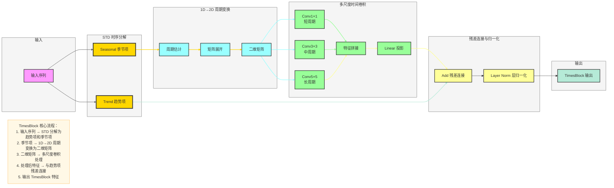

# TimesNet 组件深度解析

## 一、输入层与嵌入层

### 1. 输入处理
- **输入格式**：形状为 (batch_size, seq_len, n_features) 的张量，其中 seq_len 为输入序列长度，n_features 为特征维度
- **数据预处理**：
  - 标准化：将输入序列归一化到均值为 0、标准差为 1
  - 缺失值处理：使用插值或填充方法处理缺失数据

### 2. 嵌入层
- **Value Embedding**：将输入特征映射到高维空间，捕捉特征间的非线性关系
- **Positional Embedding**：添加位置信息，使模型能够区分不同时间步的特征
- **Embedding Sum**：将值嵌入和位置嵌入相加，融合特征和位置信息

## 二、STD 时序分解

### 1. 核心原理
- **分解目标**：将原始序列分解为趋势项（Trend）、季节项（Seasonal）和残差项（Residual）
- **数学公式**：
  
  $$
  X = Trend + Seasonal + Residual
  $$

### 2. 实现方法
- **移动平均法**：使用滑动窗口计算趋势项
- **季节项提取**：从原始序列中减去趋势项得到季节+残差，再通过周期平均得到季节项
- **残差项**：原始序列减去趋势项和季节项

### 3. 分解效果
- **趋势项**：捕获长期变化趋势，平滑噪声
- **季节项**：捕获周期性模式，如日、周、月周期
- **残差项**：捕获随机波动和异常值

## 三、1D→2D 周期变换

### 1. 周期估计
- **方法**：使用快速傅里叶变换（FFT）或自相关函数估计序列的主要周期长度 T
- **实现细节**：
  1. 对输入序列进行 FFT，得到频率域表示
  2. 找到功率谱中的峰值，对应主要周期
  3. 选择最大峰值对应的周期长度作为 T

### 2. 矩阵展开
- **步骤**：
  1. 输入：长度为 L 的一维序列
  2. 估计周期 T
  3. 将序列按周期 T 展开为 T × (L/T) 的二维矩阵
  4. 若 L 不能被 T 整除，进行填充

### 3. 变换优势
- **维度提升**：将一维时间依赖转换为二维空间-时间依赖
- **卷积友好**：二维结构更适合 CNN 处理，能够并行捕获周期模式

## 四、多尺度时间卷积

### 1. 核心设计
- **Inception 结构**：使用不同 kernel 大小的卷积核，捕获不同尺度的周期信息
- **卷积核配置**：
  - Conv1×1：捕获短周期模式
  - Conv3×3：捕获中周期模式
  - Conv5×5：捕获长周期模式

### 2. 实现细节
- **分组卷积**：减少参数量，提高计算效率
- **批归一化**：加速训练收敛，提高模型稳定性
- **激活函数**：使用 ReLU 或 GELU 引入非线性

### 3. 特征融合
- **Concat 拼接**：将不同尺度的卷积特征沿通道维度拼接
- **Linear 投影**：将拼接后的特征投影到固定维度，减少参数量

## 五、TimesBlock

### 1. 结构组成
- **STD 时序分解**：分解输入序列为趋势项和季节项
- **1D→2D 周期变换**：对季节项进行二维展开
- **多尺度卷积**：处理二维周期矩阵
- **残差连接**：缓解梯度消失，增强特征流动
- **层归一化**：稳定训练过程

### 2. 前向传播流程
1. 输入序列通过 STD 分解得到趋势项和季节项
2. 季节项通过 1D→2D 变换转为二维矩阵
3. 二维矩阵通过多尺度卷积处理
4. 处理后的矩阵展平为一维序列
5. 与趋势项相加，通过残差连接和层归一化

### 3. 堆叠机制
- **堆叠层数**：通常堆叠 3-6 层 TimesBlock
- **每层职责**：浅层捕获局部模式，深层捕获全局模式
- **梯度流动**：残差连接确保梯度能够有效传递到浅层

## 六、预测头

### 1. 结构设计
- **Flatten 层**：将 TimesBlock 输出的特征展平
- **Linear 层**：将特征映射到预测维度
- **输出激活**：根据任务类型选择激活函数（如回归任务无需激活）

### 2. 输出格式
- **单步预测**：输出单个时间步的预测值
- **多步预测**：输出多个时间步的预测序列

## 七、Mermaid 可视化：TimesBlock 内部结构

