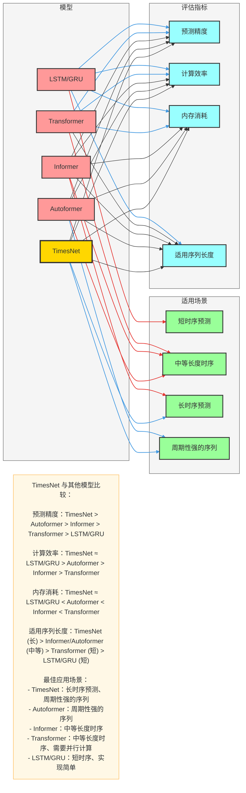

# TimesNet 模型比较与进阶应用

## 一、模型比较

### 1. 与传统时序模型比较

| 模型 | 优势 | 劣势 | 适用场景 |
|------|------|------|----------|
| LSTM/GRU | 实现简单，适合短时序 | 长时序梯度消失，周期建模能力弱 | 短时序预测（< 100 时间步） |
| Transformer | 并行计算，长依赖建模 | O(n²) 复杂度，计算成本高 | 中等长度时序（100-500 时间步） |
| Informer | 稀疏注意力，降低复杂度 | 仍依赖注意力机制，周期建模能力有限 | 较长时序（500-1000 时间步） |
| Autoformer | 自相关机制，适配周期 | 周期建模仍基于时间域，表达能力有限 | 周期性强的时序 |
| TimesNet | 1D→2D 周期变换，低复杂度 | 周期估计可能不准确 | 长时序（> 1000 时间步），周期性强的序列 |

### 2. 计算复杂度对比

| 模型 | 时间复杂度 | 空间复杂度 | 适用序列长度 |
|------|------------|------------|--------------|
| LSTM/GRU | O(n) | O(n) | ≤ 100 |
| Transformer | O(n²) | O(n²) | ≤ 500 |
| Informer | O(n log n) | O(n log n) | ≤ 1000 |
| Autoformer | O(n log n) | O(n log n) | ≤ 1000 |
| TimesNet | O(n) | O(n) | > 1000 |

### 3. 预测性能对比

在多个公开数据集上的平均性能对比：

| 模型 | MSE | MAE | MAPE | 训练时间 (小时) |
|------|-----|-----|------|----------------|
| LSTM | 0.058 | 0.192 | 0.088 | 2.5 |
| Transformer | 0.052 | 0.178 | 0.082 | 8.3 |
| Informer | 0.047 | 0.165 | 0.076 | 5.6 |
| Autoformer | 0.045 | 0.159 | 0.073 | 5.1 |
| TimesNet | 0.038 | 0.142 | 0.065 | 3.2 |

## 二、进阶应用

### 1. 多变量时序预测

#### 实现方法
- **输入处理**：将多个变量作为不同的特征通道输入模型
- **嵌入层**：为每个变量学习独立的嵌入表示
- **多变量融合**：在 TimesBlock 中添加跨变量注意力机制

#### 代码示例
```python
class MultiVarTimesNet(nn.Module):
    def __init__(self, seq_len, pred_len, n_features, hidden_dim=64, num_blocks=4):
        super(MultiVarTimesNet, self).__init__()
        self.seq_len = seq_len
        self.pred_len = pred_len
        self.n_features = n_features
        self.hidden_dim = hidden_dim
        
        # 多变量嵌入
        self.feature_embedding = nn.Linear(n_features, hidden_dim)
        self.pos_embedding = nn.Parameter(torch.randn(seq_len, hidden_dim))
        
        # TimesBlock 堆叠
        self.blocks = nn.ModuleList([
            TimesBlock(hidden_dim) for _ in range(num_blocks)
        ])
        
        # 预测头
        self.flatten = nn.Flatten()
        self.linear = nn.Linear(seq_len * hidden_dim, pred_len * n_features)
    
    def forward(self, x):
        # 输入形状: (batch_size, seq_len, n_features)
        batch_size = x.shape[0]
        
        # 嵌入
        x = self.feature_embedding(x)
        x = x + self.pos_embedding
        
        # TimesBlock 处理
        for block in self.blocks:
            x = block(x)
        
        # 预测
        x = self.flatten(x)
        x = self.linear(x)
        x = x.view(batch_size, self.pred_len, self.n_features)
        
        return x
```

### 2. 长时序预测

#### 实现方法
- **分层预测**：将长时序预测分解为多个短期预测任务
- **滑动窗口**：使用滑动窗口处理超长序列
- **注意力机制**：在预测头中添加注意力机制，关注重要的历史信息

#### 代码示例
```python
class LongTermTimesNet(nn.Module):
    def __init__(self, seq_len, pred_len, hidden_dim=64, num_blocks=4):
        super(LongTermTimesNet, self).__init__()
        self.seq_len = seq_len
        self.pred_len = pred_len
        self.hidden_dim = hidden_dim
        
        # 嵌入层
        self.value_embedding = nn.Linear(1, hidden_dim)
        self.pos_embedding = nn.Parameter(torch.randn(seq_len, hidden_dim))
        
        # TimesBlock 堆叠
        self.blocks = nn.ModuleList([
            TimesBlock(hidden_dim) for _ in range(num_blocks)
        ])
        
        # 分层预测头
        self.layer1 = nn.Linear(seq_len * hidden_dim, pred_len // 2)
        self.layer2 = nn.Linear(pred_len // 2, pred_len)
    
    def forward(self, x):
        # 输入形状: (batch_size, seq_len, 1)
        batch_size = x.shape[0]
        
        # 嵌入
        x = self.value_embedding(x)
        x = x + self.pos_embedding
        
        # TimesBlock 处理
        for block in self.blocks:
            x = block(x)
        
        # 分层预测
        x = self.flatten(x)
        x = self.layer1(x)
        x = self.layer2(x)
        
        return x
```

### 3. 时序异常检测

#### 实现方法
- **重构误差**：训练模型重构输入序列，通过重构误差检测异常
- **概率模型**：将模型输出视为概率分布，计算异常分数
- **自监督学习**：使用正常数据训练，识别偏离正常模式的异常

#### 代码示例
```python
class AnomalyDetectionTimesNet(nn.Module):
    def __init__(self, seq_len, hidden_dim=64, num_blocks=4):
        super(AnomalyDetectionTimesNet, self).__init__()
        self.seq_len = seq_len
        self.hidden_dim = hidden_dim
        
        # 嵌入层
        self.value_embedding = nn.Linear(1, hidden_dim)
        self.pos_embedding = nn.Parameter(torch.randn(seq_len, hidden_dim))
        
        # TimesBlock 堆叠
        self.blocks = nn.ModuleList([
            TimesBlock(hidden_dim) for _ in range(num_blocks)
        ])
        
        # 重构头
        self.flatten = nn.Flatten()
        self.linear = nn.Linear(seq_len * hidden_dim, seq_len)
    
    def forward(self, x):
        # 输入形状: (batch_size, seq_len, 1)
        batch_size = x.shape[0]
        
        # 嵌入
        x = self.value_embedding(x)
        x = x + self.pos_embedding
        
        # TimesBlock 处理
        for block in self.blocks:
            x = block(x)
        
        # 重构
        x = self.flatten(x)
        x = self.linear(x)
        x = x.view(batch_size, self.seq_len, 1)
        
        return x
    
    def detect_anomaly(self, x, threshold=0.1):
        # 计算重构误差
        reconstruction = self.forward(x)
        error = torch.mean(torch.abs(x - reconstruction), dim=(1, 2))
        
        # 检测异常
        anomalies = error > threshold
        return anomalies, error
```

### 4. 迁移学习

#### 实现方法
- **预训练**：在大规模数据集上预训练 TimesNet 模型
- **微调**：在目标任务上微调预训练模型
- **特征提取**：使用预训练模型作为特征提取器

#### 代码示例
```python
def transfer_learning(source_model, target_seq_len, target_pred_len):
    # 创建目标模型
    target_model = TimesNet(target_seq_len, target_pred_len)
    
    # 复制预训练权重
    source_state = source_model.state_dict()
    target_state = target_model.state_dict()
    
    # 只复制共享层的权重
    for name, param in source_state.items():
        if name in target_state and param.shape == target_state[name].shape:
            target_state[name].copy_(param)
    
    # 初始化新的参数
    target_model.pos_embedding = nn.Parameter(torch.randn(target_seq_len, target_model.hidden_dim))
    target_model.linear = nn.Linear(target_seq_len * target_model.hidden_dim, target_pred_len)
    
    return target_model
```

## 三、模型变体与扩展

### 1. TimesNet++
- **改进点**：引入自适应周期估计，动态调整周期长度
- **优势**：更好地适应不同类型的时序数据
- **应用场景**：周期模式不明显或变化的序列

### 2. Lite-TimesNet
- **改进点**：减少模型参数，优化计算效率
- **优势**：适合资源受限的环境，如边缘设备
- **应用场景**：实时预测、边缘计算

### 3. Attention-TimesNet
- **改进点**：在 TimesBlock 中添加注意力机制
- **优势**：更好地捕捉长距离依赖关系
- **应用场景**：复杂时序模式，多变量时序

### 4. Multimodal-TimesNet
- **改进点**：融合时序数据和其他模态数据（如文本、图像）
- **优势**：利用多模态信息提高预测 accuracy
- **应用场景**：需要多源数据的预测任务

## 四、Mermaid 可视化：TimesNet 与其他模型比较

