**标准 Vision Transformer (ViT) 架构图**（图像分类SOTA模型，严格贴合论文核心：**图像→补丁序列、Transformer编码器、多头注意力**），风格和TimesNet架构完全统一，可直接用于笔记/PPT。

# Vision Transformer (ViT) 完整架构流程图

```mermaid
flowchart LR
    %% 统一样式（和TimesNet风格一致）
    classDef inputStyle fill:#f9f,stroke:#333,stroke-width:2px,rounded:8px
    classDef embedStyle fill:#ffd700,stroke:#333,stroke-width:2px,rounded:8px
    classDef blockStyle fill:#9ff,stroke:#333,stroke-width:2px,rounded:8px
    classDef convStyle fill:#9f9,stroke:#333,stroke-width:2px,rounded:8px
    classDef decompStyle fill:#ff9,stroke:#333,stroke-width:2px,rounded:8px
    classDef headStyle fill:#f2e6ff,stroke:#333,stroke-width:2px,rounded:8px
    classDef subgraphStyle fill:#f5f5f5,stroke:#666,stroke-width:1px,rounded:10px
    classDef coreNoteStyle fill:#fff8e6,stroke:#ffb74d,stroke-width:1px,rounded:8px

    %% 1. 输入层
    subgraph InputLayer["输入层"]
        A[彩色图像<br/>RGB Image]:::inputStyle
    end
    class InputLayer subgraphStyle

    %% 2. 补丁嵌入层
    subgraph PatchEmbedLayer["补丁嵌入层"]
        B[Patch Embedding<br/>补丁嵌入]:::embedStyle
        C[CLS Token<br/>分类标记]:::embedStyle
        D[Token Concatenation<br/>标记拼接]:::embedStyle
        E[Positional Encoding<br/>位置编码]:::embedStyle
        F[Embedding Output<br/>嵌入输出]:::embedStyle
    end
    class PatchEmbedLayer subgraphStyle

    %% 3. 核心：Transformer Encoder 堆叠（N层）
    subgraph TransformerStack["Transformer Encoder 堆叠 × N（核心）"]
        %% 单个Transformer Encoder
        subgraph TransformerEncoder1["Transformer Encoder 1"]
            %% 多头注意力机制
            subgraph MHA1["多头注意力机制"]
                G[Layer Norm 1<br/>层归一化]:::blockStyle
                H[Multi-Head Attention<br/>多头注意力]:::blockStyle
                I[Add<br/>残差连接]:::blockStyle
            end
            class MHA1 subgraphStyle

            %% 前馈神经网络
            subgraph MLPBlock1["前馈神经网络"]
                J[Layer Norm 2<br/>层归一化]:::blockStyle
                K[MLP<br/>前馈神经网络]:::blockStyle
                L[Add<br/>残差连接]:::blockStyle
            end
            class MLPBlock1 subgraphStyle
        end
        class TransformerEncoder1 subgraphStyle
        
        %% 堆叠表示
        subgraph TransformerEncoderN["Transformer Encoder N"]
            %% 多头注意力机制
            subgraph MHAN["多头注意力机制"]
                M[Layer Norm 1<br/>层归一化]:::blockStyle
                N[Multi-Head Attention<br/>多头注意力]:::blockStyle
                O[Add<br/>残差连接]:::blockStyle
            end
            class MHAN subgraphStyle

            %% 前馈神经网络
            subgraph MLPBlockN["前馈神经网络"]
                P[Layer Norm 2<br/>层归一化]:::blockStyle
                Q[MLP<br/>前馈神经网络]:::blockStyle
                R[Add<br/>残差连接]:::blockStyle
            end
            class MLPBlockN subgraphStyle
        end
        class TransformerEncoderN subgraphStyle
        
        %% 堆叠箭头
        TransformerEncoder1 --> TransformerEncoderN
    end
    class TransformerStack subgraphStyle

    %% 4. 分类输出层
    subgraph OutputLayer["分类头"]
        S[CLS Token 提取<br/>提取分类标记]:::headStyle
        T[Linear 分类层<br/>输出类别概率]:::headStyle
        U[分类结果<br/>Classification Output]:::inputStyle
    end
    class OutputLayer subgraphStyle

    %% 核心注释（ViT创新点）
    Note["Vision Transformer 核心创新：<br/>1. 将图像分割为补丁序列，作为Transformer输入<br/>2. 引入CLS Token用于分类任务<br/>3. 使用位置编码保留空间信息<br/>4. 堆叠Transformer Encoder捕获全局依赖<br/>5. 多头注意力机制并行学习不同表示子空间"]:::coreNoteStyle

    %% 修正后的数据流（移除冗余连接，保证逻辑清晰）
    A --> B
    B --> D
    C --> D
    D --> E
    E --> F
    F --> G
    G --> H
    H --> I
    I --> J
    J --> K
    K --> L
    L --> M
    M --> N
    N --> O
    O --> P
    P --> Q
    Q --> R
    R --> S
    S --> T
    T --> U

    %% 修正后的连接线样式（按实际连接顺序指定，避免索引越界）
    %% 输入层 → 嵌入层（前5条连接）
    linkStyle 0,1,2,3,4 stroke:#ff7043,stroke-width:1.5px
    %% 嵌入层 → Transformer → 分类头（中间14条连接）
    linkStyle 5,6,7,8,9,10,11,12,13,14,15,16,17,18 stroke:#4299e1,stroke-width:2px
    %% 分类头最终输出（最后1条连接，若需区分可单独指定）
    linkStyle 18 stroke:#9c27b0,stroke-width:2px

    %% 可选：将注释节点定位到合适位置（提升可读性）
    Note -.-> TransformerStack
```

---

# Vision Transformer (ViT) 极简核心总结

1. **定位**：**图像分类** SOTA 模型，将Transformer架构应用于计算机视觉任务
2. **核心Backbone**：**Transformer Encoder** 堆叠
3. **最大创新**
    - 将**图像分割为补丁序列**，作为Transformer输入
    - 引入**CLS Token**专门用于分类任务
    - 使用**位置编码**保留空间信息
    - 多头注意力机制**并行学习不同表示子空间**
    - 捕获**全局依赖关系**，不受感受野限制
4. **结构范式**
输入图像 → 补丁嵌入 + CLS Token + 位置编码 → Transformer Encoder（多头注意力+MLP）→ CLS Token提取 → 分类头

---

# Vision Transformer (ViT) 数据流转逻辑详解

## 输入层
- **输入格式**：彩色图像数据，形状为 `[batch_size, height, width, channels]`
  - `batch_size`：批量大小
  - `height`：图像高度
  - `width`：图像宽度
  - `channels`：通道数（RGB为3）
- **输入示例**：各种需要分类的彩色图像

## 补丁嵌入层
1. **补丁嵌入（Patch Embedding）**
   - 将图像分割为固定大小的补丁（如16×16）
   - 通过线性投影将每个补丁映射到高维特征空间
   - 输出形状：`[batch_size, num_patches, d_model]`，其中 `num_patches` 为补丁数量，`d_model` 为模型维度
2. **CLS Token**
   - 添加一个特殊的分类标记到补丁序列开头
   - 用于最终的分类任务
3. **标记拼接（Token Concatenation）**
   - 将CLS Token与补丁嵌入序列进行拼接
   - 输出形状：`[batch_size, num_patches+1, d_model]`
4. **位置编码（Positional Encoding）**
   - 注入位置信息，使模型感知补丁的空间位置
   - 避免位置信息丢失
5. **嵌入输出（Embedding Output）**
   - 最终的嵌入表示，作为Transformer Encoder的输入
   - 输出形状：`[batch_size, num_patches+1, d_model]`

## Transformer Encoder 核心处理流程（N层堆叠）
### 堆叠结构
- **多层堆叠**：通常包含12-24层Transformer Encoder
- **层间连接**：每一层的输出作为下一层的输入

### 单层处理流程
1. **多头注意力机制**
   - **层归一化（Layer Norm 1）**：对输入特征进行归一化
   - **多头注意力（Multi-Head Attention）**：并行计算多个注意力头，捕获不同子空间的特征
   - **残差连接（Add）**：将注意力输出与输入相加，保留原始信息

2. **前馈神经网络**
   - **层归一化（Layer Norm 2）**：对注意力输出进行归一化
   - **MLP**：包含两个线性层和激活函数，增强模型表达能力
   - **残差连接（Add）**：将MLP输出与输入相加，保留原始信息

## 分类输出层
1. **CLS Token 提取**：提取序列中的CLS Token特征
2. **线性分类层**：将CLS Token特征映射到类别空间
3. **分类结果**：输出类别概率分布
   - 输出形状：`[batch_size, num_classes]`
   - `num_classes`：类别数量

## 完整数据流转路径
输入图像 → 补丁嵌入 → 标记拼接（添加CLS Token） → 位置编码 → 嵌入输出 → Transformer Encoder 1 → ... → Transformer Encoder N → CLS Token提取 → 线性分类层 → 分类结果

## 关键技术点
- **补丁序列化**：将2D图像转换为1D序列，适配Transformer架构
- **全局依赖建模**：通过自注意力机制捕获图像全局信息
- **多头注意力**：并行学习不同表示子空间，增强特征表达
- **残差连接**：缓解深层网络训练困难
- **层归一化**：稳定训练过程，加速收敛
- **端到端学习**：从原始图像到分类结果的端到端训练
