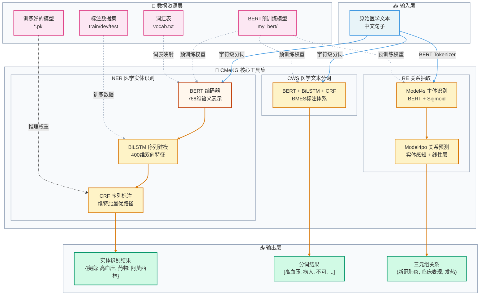
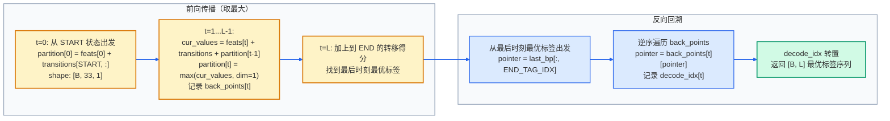
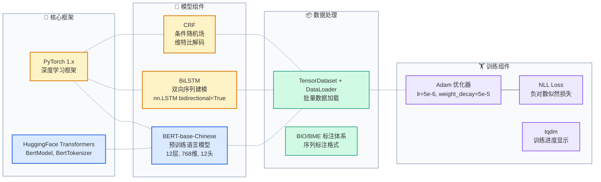

# CMeKG NER 完整架构分析文档

> **项目**：CMeKG_tools — 中文医学知识图谱工具集  
> **核心任务**：医学命名实体识别（NER）、医学文本分词（CWS）、医学关系抽取（RE）  
> **模型架构**：BERT + BiLSTM + CRF  

---

## 目录

1. [项目整体架构图（基础版）](#1-项目整体架构图基础版)
2. [项目架构图（详细版）](#2-项目架构图详细版)
3. [NER 模型架构图](#3-ner-模型架构图)
4. [完整训练流程讲解](#4-完整训练流程讲解)
5. [完整预测流程讲解](#5-完整预测流程讲解)
6. [数据处理全流程（含维度变化）](#6-数据处理全流程含维度变化)
7. [CRF 训练与解码流程](#7-crf-训练与解码流程)
8. [模块关系矩阵](#8-模块关系矩阵)
9. [技术栈分析](#9-技术栈分析)

---

## 1. 项目整体架构图（基础版）



---

## 2. 项目架构图（详细版）

```mermaid
flowchart LR
    %% ===== 样式定义 =====
    classDef fileStyle fill:#dbeafe,stroke:#2563eb,stroke-width:1.5px
    classDef classStyle fill:#fef3c7,stroke:#92400e,stroke-width:2px
    classDef funcStyle fill:#d1fae5,stroke:#065f46,stroke-width:1.5px
    classDef configStyle fill:#fce7f3,stroke:#9d174d,stroke-width:1.5px
    classDef bertStyle fill:#fff7ed,stroke:#c2410c,stroke-width:2px
    classDef crfStyle fill:#ede9fe,stroke:#5b21b6,stroke-width:2px
    classDef subgraphStyle fill:#f8fafc,stroke:#94a3b8,stroke-width:1.5px

    %% ===== 配置常量层 =====
    subgraph constLayer["⚙️ 配置常量层"]
        NC[ner_constant.py<br/>──────<br/>l2i_dic: 标签→ID映射<br/>i2l_dic: ID→标签映射<br/>max_length=450<br/>batch_size=1<br/>epochs=30<br/>tagset_size=31]:::configStyle
    end
    class constLayer subgraphStyle

    %% ===== 工具函数层 =====
    subgraph utilLayer["🛠️ 工具函数层 utils.py"]
        U1[InputFeatures<br/>──────<br/>text, label<br/>input_id, label_id<br/>input_mask, length]:::classStyle
        U2[load_vocab<br/>词表文件→字典]:::funcStyle
        U3[load_file<br/>BIO格式→文本/标签列表]:::funcStyle
        U4[load_data<br/>构建InputFeatures<br/>padding/截断/CLS-SEP]:::funcStyle
        U5[recover_label<br/>ID序列→标签序列]:::funcStyle
        U6[get_ner_fmeasure<br/>P/R/F1 评估]:::funcStyle
    end
    class utilLayer subgraphStyle

    %% ===== 模型层 =====
    subgraph modelLayer["🤖 模型层 model_ner/"]
        subgraph bertlstmcrf["BERT_LSTM_CRF (bert_lstm_crf.py)"]
            M1[BertModel<br/>BERT预训练编码器<br/>768维输出]:::bertStyle
            M2[nn.LSTM<br/>双向2层<br/>768→400维]:::classStyle
            M3[nn.Linear × 2<br/>400→200→33维]:::funcStyle
            M4[CRF Layer<br/>条件随机场]:::crfStyle
        end
        class bertlstmcrf subgraphStyle

        subgraph crfDetail["CRF (crf.py)"]
            C1[transitions<br/>33×33转移矩阵]:::crfStyle
            C2[_forward_alg<br/>前向算法/配分函数]:::funcStyle
            C3[_score_sentence<br/>真实路径得分]:::funcStyle
            C4[_viterbi_decode<br/>维特比解码]:::funcStyle
            C5[neg_log_likelihood_loss<br/>NLL损失 = Z - score_gold]:::funcStyle
        end
        class crfDetail subgraphStyle
    end
    class modelLayer subgraphStyle

    %% ===== 训练层 =====
    subgraph trainLayer["🏋️ 训练层 train_ner.py"]
        T1[数据加载<br/>train/dev/test DataLoader]:::funcStyle
        T2[模型初始化<br/>BERT_LSTM_CRF]:::classStyle
        T3[Adam优化器<br/>lr=5e-6]:::funcStyle
        T4[训练循环<br/>neg_log_likelihood_loss]:::funcStyle
        T5[evaluate()<br/>验证集P/R/F1]:::funcStyle
        T6[evaluate_test()<br/>测试集推理+保存结果]:::funcStyle
        T7[模型保存<br/>best_f → *.pkl]:::funcStyle
    end
    class trainLayer subgraphStyle

    %% ===== 推理层 =====
    subgraph inferLayer["🔍 推理层 medical_ner.py"]
        I1[medical_ner 类<br/>──────<br/>from_input(): 单句预处理<br/>from_txt(): 文件预处理]:::classStyle
        I2[predict_sentence()<br/>单句实体识别]:::funcStyle
        I3[predict_file()<br/>批量文件识别]:::funcStyle
        I4[split_entity_input()<br/>BME序列→实体span]:::funcStyle
    end
    class inferLayer subgraphStyle

    %% ===== 连接关系 =====
    NC -->|标签配置| U4
    NC -->|tagset_size| M4
    NC -->|i2l_dic| U5

    U2 -->|vocab dict| U4
    U3 -->|texts,labels| U4
    U4 -->|InputFeatures| T1

    M1 -->|768维embedding| M2
    M2 -->|400维双向特征| M3
    M3 -->|33维emission得分| M4
    C1 -.->|转移约束| C4
    C2 --> C5
    C3 --> C5

    T1 --> T2 --> T3
    T2 -->|forward pass| T4
    T4 -->|neg_log_likelihood| T5
    T5 -->|best_f更新| T7

    I1 -->|预处理张量| I2
    I2 -->|predict_tags| I4
    I4 -->|entity_mark| I2

    linkStyle 0,1,2,3,4,5 stroke:#94a3b8,stroke-width:1px
    linkStyle 6,7,8,9,10,11 stroke:#d97706,stroke-width:2px
    linkStyle 12,13,14,15,16 stroke:#059669,stroke-width:1.5px
    linkStyle 17,18,19,20 stroke:#7c3aed,stroke-width:1.5px
```

---

## 3. NER 模型架构图

```mermaid
flowchart TB
    %% ===== 样式 =====
    classDef inputStyle fill:#dbeafe,stroke:#1d4ed8,stroke-width:2px
    classDef bertStyle fill:#fff7ed,stroke:#c2410c,stroke-width:2.5px
    classDef lstmStyle fill:#fef3c7,stroke:#92400e,stroke-width:2px
    classDef linearStyle fill:#d1fae5,stroke:#065f46,stroke-width:1.5px
    classDef crfStyle fill:#ede9fe,stroke:#5b21b6,stroke-width:2.5px
    classDef outputStyle fill:#fce7f3,stroke:#9d174d,stroke-width:2px
    classDef dimStyle fill:#f1f5f9,stroke:#64748b,stroke-width:1px
    classDef subgraphStyle fill:#f8fafc,stroke:#cbd5e1,stroke-width:1.5px

    %% ===== 输入 =====
    subgraph inputGroup["输入层"]
        IN["原始句子<br/>例：'患者出现发热症状'<br/>（N个汉字）"]:::inputStyle
        IN_DIM["[batch_size=B, seq_len=L]<br/>添加[CLS]和[SEP]后: L ≤ 450"]:::dimStyle
    end
    class inputGroup subgraphStyle

    %% ===== BERT =====
    subgraph bertGroup["BERT 编码层（冻结/微调）"]
        TOKENIZE["Token化<br/>字符→Token ID<br/>+[CLS], [SEP], Padding"]:::bertStyle
        BERT["BertModel<br/>12层 Transformer<br/>768维隐层"]:::bertStyle
        EMBED_DROP["Dropout(0.5)<br/>防止BERT过拟合"]:::bertStyle
        B_DIM["输出维度: [B, L, 768]"]:::dimStyle
    end
    class bertGroup subgraphStyle

    %% ===== BiLSTM =====
    subgraph lstmGroup["BiLSTM 序列建模层"]
        HIDDEN["rand_init_hidden()<br/>初始化 h0, c0<br/>形状: [4, B, 200]"]:::lstmStyle
        BILSTM["BiLSTM<br/>input=768, hidden=200<br/>num_layers=2, bidirectional=True"]:::lstmStyle
        LSTM_OUT["Reshape<br/>[B×L, 400]"]:::lstmStyle
        DROP1["Dropout(0.5)"]:::lstmStyle
        LINEAR1["Linear(400→200)"]:::linearStyle
        DROP2["Dropout(0.5)"]:::lstmStyle
        LINEAR2["Linear(200→33)"]:::linearStyle
        RESHAPE["Reshape<br/>[B, L, 33]"]:::lstmStyle
        L_DIM["emission得分维度: [B, L, 33]<br/>（33 = tagset_size+2, 含START/END）"]:::dimStyle
    end
    class lstmGroup subgraphStyle

    %% ===== CRF =====
    subgraph crfGroup["CRF 条件随机场层"]
        TRANS["Transitions矩阵<br/>可学习参数: [33, 33]<br/>编码标签间转移规则"]:::crfStyle
        subgraph trainPath["训练路径"]
            FORWARD_ALG["_forward_alg()<br/>前向算法 → 配分函数 Z<br/>所有路径得分之和（log-sum-exp）"]:::crfStyle
            SCORE_SENT["_score_sentence()<br/>真实标签路径得分 score_gold"]:::crfStyle
            NLL_LOSS["neg_log_likelihood_loss<br/>Loss = Z - score_gold<br/>最大化真实路径概率"]:::crfStyle
        end
        class trainPath subgraphStyle
        subgraph decodePath["推理路径"]
            VITERBI["_viterbi_decode()<br/>维特比算法<br/>回溯最优标签序列"]:::crfStyle
        end
        class decodePath subgraphStyle
    end
    class crfGroup subgraphStyle

    %% ===== 输出 =====
    subgraph outputGroup["输出层"]
        TAGS["预测标签序列<br/>[B, L] LongTensor<br/>每位置对应一个标签ID"]:::outputStyle
        RECOVER["recover_label()<br/>ID → 标签字符串<br/>去除[CLS],[SEP],padding"]:::outputStyle
        ENTITY["实体识别结果<br/>{'疾病':'高血压', '药物':'阿莫西林'}"]:::outputStyle
    end
    class outputGroup subgraphStyle

    %% ===== 连接 =====
    IN --> TOKENIZE --> BERT --> EMBED_DROP
    EMBED_DROP --> HIDDEN
    HIDDEN --> BILSTM
    BILSTM --> LSTM_OUT --> DROP1 --> LINEAR1 --> DROP2 --> LINEAR2 --> RESHAPE
    RESHAPE -->|emission feats [B,L,33]| FORWARD_ALG
    RESHAPE -->|emission feats [B,L,33]| SCORE_SENT
    FORWARD_ALG --> NLL_LOSS
    SCORE_SENT --> NLL_LOSS
    RESHAPE -->|推理时| VITERBI
    TRANS -.->|转移约束| FORWARD_ALG
    TRANS -.->|转移约束| VITERBI
    VITERBI --> TAGS --> RECOVER --> ENTITY

    IN_DIM -.-> BERT
    B_DIM -.-> BILSTM
    L_DIM -.-> TRANS

    %% ===== 连接线样式 =====
    linkStyle 0,1,2,3 stroke:#1d4ed8,stroke-width:2px
    linkStyle 4,5,6,7,8,9,10,11 stroke:#92400e,stroke-width:2px
    linkStyle 12,13 stroke:#5b21b6,stroke-width:1.5px
    linkStyle 14,15 stroke:#5b21b6,stroke-width:2px
    linkStyle 16,17 stroke:#94a3b8,stroke-width:1px,stroke-dasharray:4
    linkStyle 18,19,20 stroke:#059669,stroke-width:2px
```

---

## 4. 完整训练流程讲解

### 4.1 训练流程总览

```mermaid
flowchart TD
    %% ===== 样式 =====
    classDef stepStyle fill:#dbeafe,stroke:#2563eb,stroke-width:1.5px
    classDef decisionStyle fill:#fef3c7,stroke:#d97706,stroke-width:2px
    classDef actionStyle fill:#d1fae5,stroke:#059669,stroke-width:1.5px
    classDef lossStyle fill:#fce7f3,stroke:#db2777,stroke-width:2px
    classDef saveStyle fill:#ede9fe,stroke:#7c3aed,stroke-width:2px
    classDef subgraphStyle fill:#f8fafc,stroke:#94a3b8,stroke-width:1.5px

    S([开始训练]):::stepStyle

    subgraph init["🔧 初始化阶段"]
        A[加载词汇表 load_vocab<br/>vocab_file → vocab dict]:::stepStyle
        B[加载训练数据 load_data<br/>train_data[1500:] → DataLoader]:::stepStyle
        C[加载验证数据<br/>dev_data[:1500] → DataLoader]:::stepStyle
        D[初始化模型 BERT_LSTM_CRF<br/>bert_config, tagset_size=31<br/>embedding=768, hidden=200, layers=2]:::stepStyle
        E[初始化 Adam 优化器<br/>lr=5e-6, weight_decay=5e-5]:::stepStyle
    end
    class init subgraphStyle

    subgraph epochLoop["🔁 Epoch 循环 (epochs=30)"]
        F[遍历 train_loader 批次]:::stepStyle
        subgraph batchStep["📦 每个 Batch 步骤"]
            G[取出 sentence, masks, tags, lengths<br/>转为 Variable]:::stepStyle
            H[optimizer.zero_grad()清零梯度]:::actionStyle
            I[前向传播 get_output_score<br/>BERT → BiLSTM → Linear → emission feats]:::stepStyle
            J[CRF neg_log_likelihood_loss<br/>forward_score - gold_score]:::lossStyle
            K[loss.backward() 反向传播]:::actionStyle
            L[optimizer.step() 参数更新]:::actionStyle
        end
        class batchStep subgraphStyle
    end
    class epochLoop subgraphStyle

    subgraph evalStep["📊 Epoch 结束评估"]
        M[evaluate() 验证集推理<br/>模型切换 eval 模式<br/>model forward → viterbi decode]:::stepStyle
        N[recover_label 恢复标签<br/>get_ner_fmeasure 计算P/R/F1]:::stepStyle
        O{F1 > best_f?}:::decisionStyle
        P[evaluate_test() 测试集评估<br/>保存预测结果文件]:::saveStyle
        Q[更新 best_f<br/>torch.save model → *.pkl]:::saveStyle
    end
    class evalStep subgraphStyle

    R{所有Epoch<br/>完成?}:::decisionStyle
    E2([训练完成]):::saveStyle

    S --> A --> B --> C --> D --> E
    E --> F --> G --> H --> I --> J --> K --> L
    L -->|下一批次| F
    F -->|epoch结束| M --> N --> O
    O -->|是| P --> Q -->|下一epoch| F
    O -->|否| F
    F -->|所有epoch| R
    R -->|是| E2
    R -->|否| F

    linkStyle 0,1,2,3,4 stroke:#2563eb,stroke-width:1.5px
    linkStyle 5,6,7,8,9,10,11 stroke:#d97706,stroke-width:2px
    linkStyle 12,13,14,15,16,17 stroke:#059669,stroke-width:1.5px
```

### 4.2 训练阶段详细说明

**Step 1：数据加载**

```
train_data = load_data(train_file, max_length=450, label_dic=l2i_dic, vocab=vocab)
# 使用 [1500:] 作为训练集，前1500条作为验证集来源（注意：实际dev_file单独加载）
train_dataset = TensorDataset(train_ids, train_masks, train_tags, train_lengths)
train_loader = DataLoader(train_dataset, shuffle=True, batch_size=1)
```

**Step 2：前向传播（get_output_score）**

```
sentence: [B=1, L=450]  → BERT → [B, L, 768]
→ Dropout(0.5)          → [B, L, 768]
→ BiLSTM(768→200×2)     → [B, L, 400]
→ Reshape               → [B×L, 400]
→ Dropout(0.5)
→ Linear(400→200)       → [B×L, 200]
→ Dropout(0.5)
→ Linear(200→33)        → [B×L, 33]
→ Reshape               → [B, L, 33]   ← emission_feats（发射得分矩阵）
```

**Step 3：CRF 损失计算**

```
Loss = forward_score (配分函数Z) - gold_score (真实路径得分)
     = log Σ_all_paths exp(score) - score(y*)
```

Loss 越小 → 真实标签路径相对所有路径的概率越大 → 模型越准确。

---

## 5. 完整预测流程讲解

### 5.1 预测流程图

```mermaid
flowchart LR
    %% ===== 样式 =====
    classDef inputStyle fill:#dbeafe,stroke:#2563eb,stroke-width:2px
    classDef processStyle fill:#fef3c7,stroke:#d97706,stroke-width:1.5px
    classDef modelStyle fill:#ede9fe,stroke:#5b21b6,stroke-width:2px
    classDef outputStyle fill:#d1fae5,stroke:#059669,stroke-width:2px
    classDef subgraphStyle fill:#f8fafc,stroke:#94a3b8,stroke-width:1.5px

    %% ===== 单句预测 =====
    subgraph singlePred["单句预测 predict_sentence()"]
        A1["原始句子<br/>'患者出现发热症状'"]:::inputStyle
        A2["from_input() 预处理<br/>添加[CLS][SEP]<br/>字符→Token ID<br/>生成attention_mask<br/>Padding到max_length=450"]:::processStyle
        A3["构建 DataLoader<br/>batch_size=1"]:::processStyle
        A4["加载模型权重<br/>model.load_state_dict()"]:::modelStyle
        A5["model.eval() + no_grad<br/>model(sentence, masks)<br/>→ viterbi 解码"]:::modelStyle
        A6["predict_tags: [450]<br/>截取到实际长度<br/>去除[CLS][SEP]"]:::processStyle
        A7["split_entity_input()<br/>BME序列解析<br/>→ entity_mark dict"]:::processStyle
        A8["{'疾病':'高血压',<br/>'临床表现':'发热'}"]:::outputStyle
    end
    class singlePred subgraphStyle

    %% ===== 维特比解码细节 =====
    subgraph viterbiDetail["Viterbi 解码过程"]
        V1["emission feats<br/>[B, L, 33]"]:::modelStyle
        V2["transitions<br/>[33, 33]"]:::modelStyle
        V3["scores = feats + transitions<br/>[seq_len, B, 33, 33]"]:::processStyle
        V4["逐位置取最大路径<br/>记录 back_points"]:::processStyle
        V5["从末位反向回溯<br/>decode_idx [B, L]"]:::outputStyle
    end
    class viterbiDetail subgraphStyle

    A1 --> A2 --> A3 --> A4 --> A5 --> A6 --> A7 --> A8
    A5 -.->|内部调用| V1
    V1 --> V3
    V2 --> V3
    V3 --> V4 --> V5
    V5 -.->|tag_seq| A6

    linkStyle 0,1,2,3,4,5,6 stroke:#2563eb,stroke-width:2px
    linkStyle 7,8,9,10,11 stroke:#5b21b6,stroke-width:1.5px
```



### 5.2 实体解析：split_entity_input 逻辑

```mermaid
flowchart TD
    %% ===== 样式 =====
    classDef labelStyle fill:#dbeafe,stroke:#2563eb,stroke-width:1.5px
    classDef actionStyle fill:#fef3c7,stroke:#d97706,stroke-width:1.5px
    classDef entityStyle fill:#d1fae5,stroke:#059669,stroke-width:2px
    classDef subgraphStyle fill:#f8fafc,stroke:#94a3b8,stroke-width:1.5px

    START([开始遍历标签序列]):::labelStyle
    L1{当前标签<br/>后缀为 -B?}:::actionStyle
    L2{当前标签<br/>后缀为 -M?}:::actionStyle
    L3{当前标签<br/>后缀为 -E?}:::actionStyle
    L4[其他标签 o<br/>重置 entity_pointer=None]:::actionStyle

    B1[记录实体起始位置<br/>entity_pointer = (index, category)<br/>初始化 entity_mark[pointer]=[label]]:::entityStyle
    M1{entity_pointer 非空<br/>且类别匹配?}:::actionStyle
    M2[追加标签到 entity_mark]:::entityStyle
    E1{entity_pointer 非空<br/>且类别匹配?}:::actionStyle
    E2[追加标签，实体span确定<br/>entity_mark[pointer]=[B, M..., E]]:::entityStyle

    RESULT["返回 entity_mark<br/>{(起始位置, 类别): [B,M,E 标签列表]}"]:::entityStyle

    START --> L1
    L1 -->|是| B1 --> NEXT
    L1 -->|否| L2
    L2 -->|是| M1
    M1 -->|是| M2 --> NEXT
    M1 -->|否| NEXT
    L2 -->|否| L3
    L3 -->|是| E1
    E1 -->|是| E2 --> NEXT
    E1 -->|否| NEXT
    L3 -->|否| L4 --> NEXT
    NEXT([下一个标签]) -->|遍历完| RESULT

    linkStyle 0,1,2,3,4,5,6,7,8,9,10,11 stroke:#2563eb,stroke-width:1.5px
```

---

## 6. 数据处理全流程（含维度变化）

### 6.1 原始数据格式

训练数据为 BIO 格式，每行为 `字符\t标签`，句子间用空行分隔：

```
患	o
者	o
出	o
现	o
发	s-B
热	s-E
症	s-B
状	s-E
，	o
高	d-B
血	d-M
压	d-E
	         ← 空行，句子结束
```

### 6.2 数据处理流程与维度变化

```mermaid
flowchart TD
    %% ===== 样式 =====
    classDef rawStyle fill:#fff7ed,stroke:#c2410c,stroke-width:2px
    classDef processStyle fill:#dbeafe,stroke:#2563eb,stroke-width:1.5px
    classDef tensorStyle fill:#d1fae5,stroke:#059669,stroke-width:2px
    classDef dimStyle fill:#f1f5f9,stroke:#64748b,stroke-width:1px,font-style:italic
    classDef subgraphStyle fill:#f8fafc,stroke:#94a3b8,stroke-width:1.5px

    %% ===== 步骤 =====
    subgraph step1["① load_file() 读取原始文件"]
        S1["原始文件：字符\t标签 格式<br/>按空行分句"]:::rawStyle
        S1D["texts: List[List[str]]<br/>labels: List[List[str]]<br/>每个元素是一个句子的字符/标签列表"]:::dimStyle
    end
    class step1 subgraphStyle

    subgraph step2["② 截断处理（max_length=450）"]
        S2["若 len(token) > 448<br/>截断为前448个字符<br/>为[CLS]和[SEP]留位置"]:::processStyle
        S2D["token: len ≤ 448<br/>label: len ≤ 448"]:::dimStyle
    end
    class step2 subgraphStyle

    subgraph step3["③ 添加特殊Token"]
        S3["tokens_f = ['[CLS]'] + token + ['[SEP]']<br/>label_f = ['<start>'] + label + ['<eos>']"]:::processStyle
        S3D["tokens_f: len = N+2 (N ≤ 448)<br/>label_f: len = N+2"]:::dimStyle
    end
    class step3 subgraphStyle

    subgraph step4["④ ID 映射"]
        S4["input_ids: vocab[token] → int<br/>label_ids: l2i_dic[label] → int<br/>input_mask: [1] * (N+2)"]:::processStyle
        S4D["input_ids: List[int], len=N+2<br/>label_ids: List[int], len=N+2<br/>input_mask: List[int], len=N+2"]:::dimStyle
    end
    class step4 subgraphStyle

    subgraph step5["⑤ Padding 到 max_length=450"]
        S5["input_ids.append(0) × (450-N-2)<br/>input_mask.append(0) × (450-N-2)<br/>label_ids.append(l2i_dic['<pad>']) × (450-N-2)"]:::processStyle
        S5D["input_ids:  [450]<br/>input_mask: [450] (有效位=1,pad=0)<br/>label_ids:  [450]"]:::dimStyle
    end
    class step5 subgraphStyle

    subgraph step6["⑥ 构建 InputFeatures"]
        S6["InputFeatures 对象<br/>text, label, input_id, label_id<br/>input_mask, length=[N+2]"]:::tensorStyle
        S6D["每个样本一个 InputFeatures<br/>最终返回 List[InputFeatures]"]:::dimStyle
    end
    class step6 subgraphStyle

    subgraph step7["⑦ 构建 TensorDataset & DataLoader"]
        S7["train_ids:    [num_samples, 450]  LongTensor<br/>train_masks:  [num_samples, 450]  LongTensor<br/>train_tags:   [num_samples, 450]  LongTensor<br/>train_lengths:[num_samples, 1]    LongTensor"]:::tensorStyle
        S7D["DataLoader: batch_size=1, shuffle=True<br/>每次取出 [1, 450] 的批次"]:::dimStyle
    end
    class step7 subgraphStyle

    S1 --> S1D --> S2 --> S2D --> S3 --> S3D
    S3D --> S4 --> S4D --> S5 --> S5D --> S6 --> S6D --> S7 --> S7D

    linkStyle 0,1,2,3,4,5,6,7,8,9,10,11,12,13 stroke:#2563eb,stroke-width:1.5px
```

### 6.3 模型内部维度变化（以 batch_size=1, seq_len=12 为例）

以输入句子 **"患者出现发热症状，高血压"**（10字 + CLS + SEP = 12个token，padding到450）为例：

| 处理步骤 | 张量形状 | 说明 |
|---------|---------|------|
| 输入 token IDs | `[1, 450]` | 前12位有效，后438位填0 |
| attention_mask | `[1, 450]` | 前12位=1，后438位=0 |
| BERT 输出 | `[1, 450, 768]` | 每个token对应768维向量 |
| Dropout(0.5) | `[1, 450, 768]` | 维度不变 |
| LSTM 初始隐层 h0 | `[4, 1, 200]` | 4=2层×双向，每层200维 |
| BiLSTM 输出 | `[1, 450, 400]` | 400=200（前向）+200（后向） |
| Reshape | `[450, 400]` | 展平batch和序列维 |
| Dropout(0.5) | `[450, 400]` | 维度不变 |
| Linear(400→200) | `[450, 200]` | 压缩特征 |
| Dropout(0.5) | `[450, 200]` | 维度不变 |
| Linear(200→33) | `[450, 33]` | 33=31标签+START+END |
| Reshape（emission feats） | `[1, 450, 33]` | 每位置对应33个标签的emission得分 |
| CRF 转移矩阵 | `[33, 33]` | 可学习的标签转移概率 |
| Viterbi 输出 decode_idx | `[1, 450]` | 每位置的最优标签ID |
| recover_label 后 | `[12]` → `[10]` | 截取有效长度，去掉CLS/SEP |

---

## 7. CRF 训练与解码流程

### 7.1 CRF 训练（neg_log_likelihood_loss）

**目标**：最大化真实标签路径的条件概率

$$P(y | x) = \frac{\exp(\text{score}(x, y))}{\sum_{y'} \exp(\text{score}(x, y'))} = \frac{\exp(\text{score\_gold})}{\exp(Z)}$$

**损失函数**：

$$\mathcal{L} = -\log P(y|x) = Z - \text{score\_gold}$$

其中：
- **score_gold** = 真实标签序列的路径得分（发射得分 + 转移得分之和）
- **Z** = 配分函数，所有可能路径得分的 log-sum-exp

### 7.2 Viterbi 解码详解



### 7.3 标签体系说明

项目使用 **BME（Begin-Middle-End）** 标注体系，共9类实体、28个有效标签 + 3个特殊标签：

| 实体类别 | 标签前缀 | 标签示例 |
|---------|---------|---------|
| 疾病 (Disease) | d | d-B, d-M, d-E |
| 临床表现 (Symptom) | s | s-B, s-M, s-E |
| 身体部位 (Body) | b | b-B, b-M, b-E |
| 医疗设备 (Equipment) | e | e-B, e-M, e-E |
| 医疗程序 (Procedure) | p | p-B, p-M, p-E |
| 微生物类 (Microorganism) | m | m-B, m-M, m-E |
| 科室 (Department) | k | k-B, k-M, k-E |
| 医学检验项目 (Lab) | i | i-B, i-M, i-E |
| 药物 (Drug) | y | y-B, y-M, y-E |
| 其他 | o | o |
| 特殊标签 | — | `<pad>`, `<start>`, `<eos>` |

**示例**：句子"高血压患者"的标注序列

```
高 → d-B   （疾病实体开始）
血 → d-M   （疾病实体中间）
压 → d-E   （疾病实体结束）
患 → o     （非实体）
者 → o     （非实体）
```

---

## 8. 模块关系矩阵

| 模块 | 调用 | 被调用 | 核心职责 |
|------|------|--------|---------|
| `ner_constant.py` | — | `train_ner.py`, `medical_ner.py`, `utils.py` | 标签映射、超参数配置 |
| `utils.py` | `cws_constant.py` | `train_ner.py`, `medical_ner.py` | 数据加载、特征构建、评估 |
| `model_ner/crf.py` | — | `model_ner/bert_lstm_crf.py` | CRF 前向/解码/损失 |
| `model_ner/bert_lstm_crf.py` | `BertModel`, `CRF` | `train_ner.py`, `medical_ner.py` | BERT+BiLSTM+CRF 主模型 |
| `train_ner.py` | `utils`, `ner_constant`, `BERT_LSTM_CRF` | — | 训练入口、评估、保存 |
| `medical_ner.py` | `utils`, `ner_constant`, `BERT_LSTM_CRF` | — | 推理入口、实体解析 |
| `model_re/medical_re.py` | `BertModel`, `BertTokenizer` | — | 关系抽取模型（独立模块） |

---

## 9. 技术栈分析



### 关键超参数汇总

| 参数 | 值 | 说明 |
|-----|---|------|
| `max_length` | 450 | 序列最大长度（含 CLS/SEP） |
| `batch_size` | 1 | 每批样本数 |
| `epochs` | 30 | 训练轮次 |
| `embedding_dim` | 768 | BERT 输出维度 |
| `hidden_dim` | 200 | LSTM 单向隐层维度 |
| `rnn_layers` | 2 | LSTM 层数 |
| `dropout_ratio` | 0.5 | LSTM 层间 Dropout |
| `dropout1` | 0.5 | 全连接层 Dropout |
| `learning_rate` | 5e-6 | Adam 学习率 |
| `weight_decay` | 5e-5 | L2 正则化 |
| `tagset_size` | 31 | 标签总数（含特殊标签） |
| CRF target_size | 31+2=33 | 含 START/END 标签 |

---

## 附录：完整数据处理示例

以句子 **"高血压患者服用阿莫西林"** 为例，演示完整数据流：

### 输入原始数据（BIO 格式）
```
高	d-B
血	d-M
压	d-E
患	o
者	o
服	o
用	o
阿	y-B
莫	y-M
西	y-M
林	y-E
```

### load_file() 输出
```python
texts  = [['高','血','压','患','者','服','用','阿','莫','西','林']]
labels = [['d-B','d-M','d-E','o','o','o','o','y-B','y-M','y-M','y-E']]
```

### 添加特殊 Token
```python
tokens_f = ['[CLS]','高','血','压','患','者','服','用','阿','莫','西','林','[SEP]']
label_f  = ['<start>','d-B','d-M','d-E','o','o','o','o','y-B','y-M','y-M','y-E','<eos>']
# 长度 = 11 + 2 = 13
```

### ID 映射
```python
input_ids  = [101, 7770, 6378, 1327, 2642, 2642, 3302, 4500, 7555, 5074, 6205, 3360, 102,
              0, 0, ..., 0]   # 后 437 位 padding=0
             # ← 13个有效 →   ← 437个padding →    共450个

input_mask = [1,1,1,1,1,1,1,1,1,1,1,1,1, 0,0,...,0]  # 450维

label_ids  = [29, 1, 2, 3, 0, 0, 0, 0, 25, 26, 26, 27, 30,
              28, 28, ..., 28]  # <start>=29, d-B=1, y-B=25, <eos>=30, <pad>=28
             # 共450维
```

### BERT 编码输出（维度示例）
```
input: [1, 450]
       ↓ BertModel（12层Transformer）
output: [1, 450, 768]  # 每个位置768维上下文表示
        ↓ Dropout(0.5)
        [1, 450, 768]
```

### BiLSTM 输出
```
[1, 450, 768]  →  BiLSTM(768→200, layers=2, bidir=True)
               →  [1, 450, 400]   (400=200前向+200后向)
               →  reshape → [450, 400]
               →  Linear(400→200) → [450, 200]
               →  Linear(200→33)  → [450, 33]
               →  reshape → [1, 450, 33]   ← emission feats
```

### Viterbi 解码输出
```
输入 emission feats: [1, 450, 33]
输入 transitions:    [33, 33]

解码结果 decode_idx: [1, 450]
# 取有效长度13位（索引0-12）：
# [29, 1, 2, 3, 0, 0, 0, 0, 25, 26, 26, 27, 30]
# 去除 <start>(29) 和 <eos>(30)，得到11个预测标签：
# [d-B, d-M, d-E, o, o, o, o, y-B, y-M, y-M, y-E]
```

### split_entity_input() 解析结果
```python
entity_mark = {
    (0, 'd'): ['d-B', 'd-M', 'd-E'],   # 起始位置0，疾病类
    (7, 'y'): ['y-B', 'y-M', 'y-M', 'y-E']   # 起始位置7，药物类
}

# 最终实体拼接：
entity_list = {
    '疾病': '高血压',    # raw_text[0:3] = ['高','血','压']
    '药物': '阿莫西林'   # raw_text[7:11] = ['阿','莫','西','林']
}
```

---

*文档生成日期：2026-03-14*  
*项目地址：CMeKG_tools*
